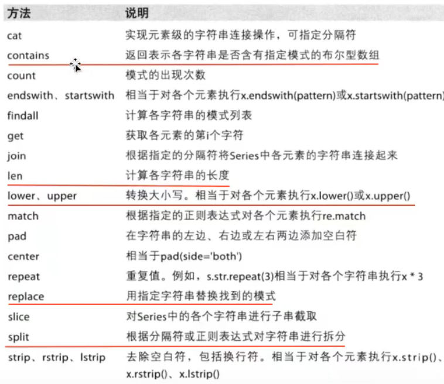

# pandas
## 导入 
    import pandas as pd
##Series(一维，带标签的数组)
## 创建Series数据
    # 注意：如果索引长度大于value长度，则value变为NaN
    # 方法一：
    # 创建一个列表，直接传入，会自动生成从0开始的索引
    value = [i for i in range(10, 15)]
    t = pd.Series(value)

    # 方法二：
    # 创建两个列表，传入index参数和值
    # 注意值要放在前面
    key = ['a', 'b', 'c', 'd', 'e']
    value = [i for i in range(10, 15)]
    t = pd.Series(value, index=key)

    # 使用字典的方式创建索引
    doc = {
    'name': 'wang_qiang',
    'age': 18,
    'tel': 10086
    }
    t = pd.Series(doc)
### 取值

#### 索引取值
    # 方法一:
    # 通过位置取值
    print(t[0])

    # 方法二:
    # 通过索引取值
    print(t['age'])

    # 方法三:
    # 取不连续的值：传入一个包含不同索引的列表
    print(t[[0, 1]])
    # 取不连续的值：传入一个包含不同键的列表
    print(t[["age", "name"]])

#### 切片取值
    # 取前三个值
    t[:2]
    # 取第4个值到第8个值，切片要头不要尾
    t[3:8]

#### 按条件取值
    # 返回满足条件的索引和行
    print(t[t>50])

### 方法

#### .index
    # 返回pandas.core.indexes.base.Index对象
    print(type(t.index))
    # 可迭代
    for i in t.index:
        print(i)
    # 可转化为list类型
    print(list(t.index))
    # 通过len获取长度
    print(len(t.index))
#### .values
    # 返回numpy.ndarray类型的对象
    # 可迭代
    for i in t.values:
        print(i)
    # 可转化为list类型
    print(list(t.values))

## DataFrame(二维， Series的容器)
### 设置最多显示多少行和多少列
    pd.set_option('display.max_rows', 10000)
    pd.set_option('display.max_columns', 100)

### 创建一个DataFrame类型的数组
    # 通过字典创建方法一
    # 字典的键会变成列索引，值会变成每一列的值
    # 注意：字典的值得长度必须相同，不然会报错
    d1 = {
    'name':list("abcde"),
    'number':list("12345"),
    'age':[13.8, 15.7, 16.5, 14.4, 15.5]
    }
    t1 = pd.DataFrame(d1)

    # 通过字典创建方法二
    # 字典中的键会变成列索引，字典的值会变成列中的值
    # 注意：如果列表中第一个字典有某个键第二个字典中没有，则这一列对应的位置是NAN
    d2 = [{'name':'jock', 'number':52, 'age':18},
      {'name':'pan', 'number':37, 'age':19},
      {'name':'dog', 'number':25, 'age':11}]
    df = pd.DataFrame(d2)
    
    # 在创建时候可以添加参数改变列索引和行索引
    # 注意：
    # 传入的参数必须是列表类型（目前为止测试结果）
    # 如果columns的参数在上边没有创建，则数据都是NAN，例如下面这个错误的例子
    df = pd.DataFrame(d2, index=list("123"), columns=list("123"))
### 获取信息
#### DataFrame基础属性：
- df.index --> 行索引
- df.columns --> 列索引  
- df.values --> 对象值，二维ndarray数组
- df.shape --> 行数，列数
- df.dtypes --> 列数据类型
- df.ndm --> 数据的维度
#### DataFrame整体情况查询
- df.head() --> 显示头部几行，默认5行
- df.tail() --> 显示末尾几行，默认5行
- df.info() --> 相关信息概览：行数，列数， 列索引，列非空值个数，列类型，内存占用
- df.describe() --> 快速综合统计：计数，均值，标准差，最大值，四分位数，最小值

### 排序
    # 按照第by列进行排序，ascending参数决定是否升序
    df.sort_values(by="close", ascending='False')
## 取值
### 索引
#### 行索引,添加索引标签
    # 行索引：叫 0轴，axis=0
    df.index
    df.index.name = 'code'
#### 列索引
    # 行索引：叫 1轴，axis=1
    df.columns
    # 修改列名用rename
    df.rename(columns={'Unnamed: 0': 'date'}, inplace=True)
### 索引数据
#### 方括号方式索引数据
    # 方括号中直接写数字，表示取行，对行进行操作
    print(df[:20])
    # 方括号中写字符串，表示取列，对列进行操作
    print(df['close'])
    # 两个方括号表示取某一列的某些行(两个方括号顺序都可以)
    print(df['close'][:20])
    # 取单个数字
    print(df['close'][1])

#### df.loc 通过标签索引
    # 筛选数据中'open'列>0的行
    df = df.loc[df['open'] > 0]

    # 取某天的close值
    df.loc["2020-01-02", "close"]
    # 取某一行(可以直接写行索引)
    df.loc["2020-01-02"]
    df.loc["2020-01-02",:]
    # 取多行
    df.loc[["2020-01-02", "2020-01-08"]]
    df.loc[["2020-01-02", "2020-01-08"], :]
    # 取某一列(不能直接写列索引，前面要加':,')
    df.loc[:, 'close']
    # 取多列
    df.loc[:, ['close', 'low']]
    # 取'close'列之前的所有列
    df.loc[:'close']
    
    # 取多行多列
    df.loc[["2020-01-02", "2020-01-08"], ['close', 'low']]
    # 下面这种是取 1月2日 到 1月8日 的close和low的值
    df.loc["2020-01-02":"2020-01-08", ['close', 'low']]

#### df.iloc 通过位置索引
    # 取第1行第二列的值
    df.iloc[1,2]
    # 取第三行
    df.iloc[3,:]
    # 取第二列
    df.iloc[:,2]
    # 取多列
    df.iloc[:, [3, 5]]
    
    # 取多行多列
    df.iloc[[0, 3], [1, 4]]
    # 下面这种是取第一行之后的每一行和第二列之后的每一列
    df.iloc[1:, 2:]
    
    # 赋值
    # 下面把选中的位置全部变成了30
    df.iloc[1:3, 1: 3] = 50

#### 布尔索引
    df = pd.read_csv("xxxxxxxxxxxxxx")
    # 多个条件的时候需要用&连接，并且每个条件需要被小括号括起来
    print( df[ (df['open'] > 30) & (df['open'] < 50)] )
    # | 是或的意思
    # 下面把df的name列的每个值都当作字符串处理，且筛选出了长度<2的值
    print( df[ (df['name'].str.len() < 2))
    # str方法包含如下方法

    # .str.contains('ST')表示是否包含‘st’
    stock_list['display_name'].str.contains('ST')
    # 可选na：如果是True则筛选出nan的值，如果是False则不筛选出
    stock_list['display_name'].str.contains('ST', na=True)
    # 可选参数casa：是否区分大小写，默认为True
    stock_list['display_name'].str.contains('ST', casa=True)